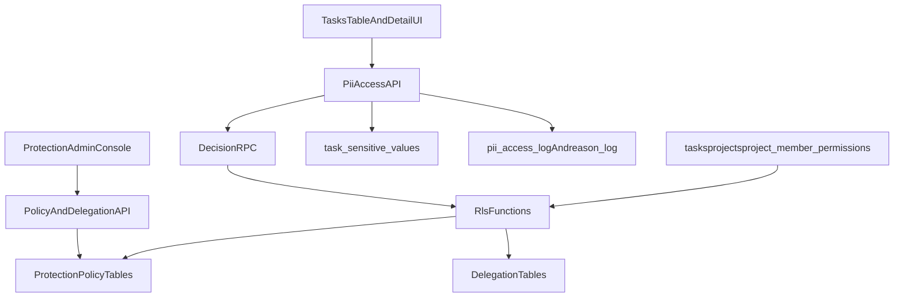
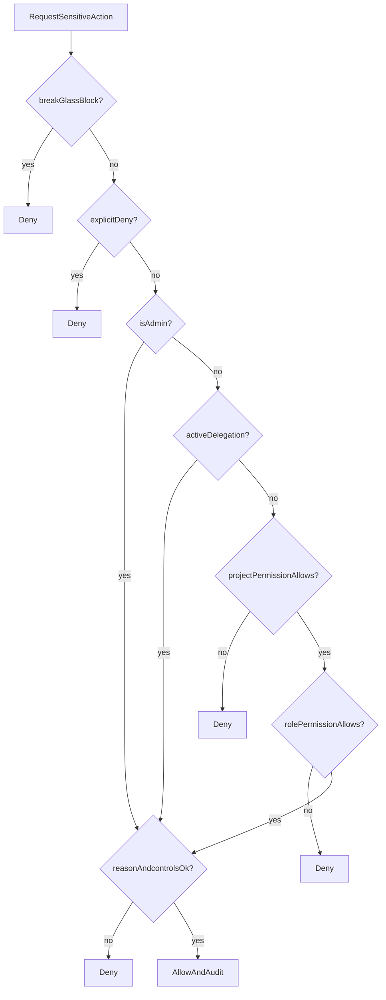

# DB-first Koruma Modulu Tasarimi

## 1) Amac ve kapsam

Bu dokumanin hedefi, hassas hucre koruma kurallarini uygulama katmanindan cikarip veritabanini tek otorite (`source of truth`) yapacak bir mimari tanimlamaktir.

Kapsam:
- Hassas veri aksiyonlari: `goruntuleme`, `duzenleme`, `maskeleme`, `kopyalama`, `maskeli export`, `maskesiz export`
- Admin olağanustu yetki ve kontrollu yetki devri (delegation)
- RLS merkezli karar modeli
- Audit, reason, telemetry, rollout ve rollback

Kapsam disi:
- Bu fazda kod/migration uygulamasi yok (yalnizca teknik tasarim)

## 2) Mevcut durum envanteri

Mevcut zemin:
- Rol/izin omurgasi: `types/permissions.ts`
- Ana RLS fonksiyonlari ve policy: `scripts/supabase-rls-policies.sql`
- Proje bazli ince izin tablosu: `scripts/project-member-permissions.sql`
- PII erisim logu: `scripts/pii-access-log.sql`
- Canli tablo hucre davranislari: `components/TasksTable.tsx`

Gozlem:
- Sistemde rol + proje izinleri bulunuyor.
- PII log mekanizmasi var.
- Ancak hassas alanin hucre bazli goruntuleme/duzenleme kararini DB tarafinda alan-bazli enforcement ile kesinlestirmek icin yeni veri modeli gerekiyor.

## 3) Hedef mimari

Temel ilke:
- Hassas alanlarin ham degeri `tasks.extra_data` yerine ayrik tabloda tutulur.
- Ham degere erisim yalnizca RPC + RLS karar motoru ile olur.
- UI maskeleme yalnizca deneyim katmanidir; guvenlik karari DB tarafindadir.

## 4) Veri modeli tasarimi

### 4.1 Hassas veri depolama

Yeni tablo:
- `task_sensitive_values`
  - `task_id uuid not null`
  - `field_key text not null`
  - `value_ciphertext text not null` (veya tokenized deger)
  - `value_hash text null` (arama/duplicate kontrol ihtiyacina gore)
  - `updated_by uuid`
  - `updated_at timestamptz`
  - PK: `(task_id, field_key)`

Not:
- `tasks.extra_data` icindeki hassas anahtarlar asamali olarak buraya tasinir.
- Uygulama gea gecis suresince maskeli placeholder gostermeye devam eder.

### 4.2 Koruma policy tablolari

Yeni tablolar:
- `sensitive_field_policies`
  - `field_pattern text` (ornek: `sicil`, `tckn`, `tc kimlik`, regex destekli)
  - `action text` (`view`, `edit`, `copy`, `export_masked`, `export_unmasked`)
  - `default_decision text` (`allow`, `deny`)
  - `requires_reason boolean`
  - `requires_ticket boolean` (opsiyonel)
  - `requires_4eyes boolean` (opsiyonel)
  - `max_session_seconds int`
  - `enabled boolean`

- `project_sensitive_policy_overrides`
  - `project_id uuid`
  - `field_key text`
  - `action text`
  - `decision text`
  - `reason_required boolean`
  - `expires_at timestamptz`

### 4.3 Delegation tablolari

- `delegation_grants`
  - `id uuid`
  - `grantor_user_id uuid` (veren)
  - `grantee_user_id uuid` (alan)
  - `scope_type text` (`global`, `project`, `task`)
  - `scope_id uuid null`
  - `field_scope text[]` (hangi hassas alanlar)
  - `allowed_actions text[]`
  - `valid_from timestamptz`
  - `valid_until timestamptz`
  - `status text` (`active`, `revoked`, `expired`)
  - `reason text`

- `delegation_events`
  - delegation olusturma, revize, revoke, expire islemlerinin immutable audit izi

### 4.4 Denetim tablolari

- `pii_access_log` (mevcut, korunacak)
- `pii_access_reason_log` (gerekce kaydi; mevcut/eklenebilir)
- `pii_policy_change_log`
  - policy degisikligi kim/ne zaman/eski-yeni

## 5) Yetki precedence (karar sirasi)

Bir aksiyon icin tek karar agaci:

1. `break_glass_block` aktif mi? (sistem koruma modu)  
2. Explicit `deny` var mi? (project override veya field policy)  
3. Kullanici `admin` mi? (olağanustu yetki)  
4. Aktif delegation grant var mi?  
5. Proje bazli izin (`project_member_permissions`) uygun mu?  
6. Global rol izni uygun mu?  
7. Reason/ticket/2-person kurali saglandi mi?  
8. Sonuc: `allow`/`deny`

## 6) RLS ve fonksiyon sozlesmeleri

### 6.1 Yeni SQL fonksiyonlari

- `is_sensitive_field(field_key text) returns boolean`
- `resolve_sensitive_policy(project_id uuid, field_key text, action text, user_id uuid) returns jsonb`
- `is_delegation_active(user_id uuid, project_id uuid, field_key text, action text) returns boolean`
- `can_user_perform_sensitive_action(task_id uuid, field_key text, action text) returns boolean`
- `get_sensitive_value(task_id uuid, field_key text, reason text) returns text`
  - icerde karar + audit insert yapar

### 6.2 RLS prensipleri

- `task_sensitive_values`:
  - `SELECT`: dogrudan kapali (yalnizca güvenli RPC uzerinden)
  - `INSERT/UPDATE/DELETE`: rol + policy + delegation kontrollu
- `delegation_grants`:
  - admin full
  - project_manager yalnizca kendi proje scope
  - grantee sadece kendi aktif grantlarini okuyabilir
- `sensitive_field_policies`:
  - yalnizca admin yazabilir
  - read: admin + policy reviewer rolu

## 7) API sozlesmeleri (tasarim)

### 7.1 Admin policy API
- `GET /api/security/policies`
- `POST /api/security/policies`
- `PATCH /api/security/policies/:id`
- `POST /api/security/policies/simulate`

### 7.2 Delegation API
- `POST /api/security/delegations`
- `PATCH /api/security/delegations/:id/revoke`
- `GET /api/security/delegations?scope=project:<id>`

### 7.3 PII erisim API
- `POST /api/pii/access/request`
  - input: `taskId`, `fieldKey`, `action`, `reason`
  - output: `approved`, `sessionToken?`, `expiresAt?`
- `POST /api/pii/access/value`
  - input: `sessionToken`
  - output: `value` (yalnizca allow ise)

## 8) UI modulu tasarimi

Yeni yonetim modulu:
- `Yonetim > Koruma Ayarlari`
  - Field policy matrisi
  - Proje bazli override paneli
  - Delegation olusturma/iptal ekrani
  - Simulasyon paneli (user+project+field+action -> beklenen karar)

Destek ekranlari:
- `Yonetim > PII Erişim Denetimi`
  - `pii_access_log` + `reason_log` + `delegation_events` korelasyonu
- `Yonetim > Policy Degisiklik Gecmisi`

## 9) Risk kontrolleri

- Rate limit:
  - `request` ve `value` endpointleri icin user/IP bazli sliding window
- Break-glass:
  - Acil durumda maskesiz exportu global kapatan feature flag
- Dual control:
  - `export_unmasked` icin opsiyonel ikinci onay (4-eyes)
- Secret hygiene:
  - Token imzalama sirri yalnizca server env
- Telemetry:
  - `pii_access_request_total{action,decision,role}`
  - `pii_access_denied_total{reason_code}`
  - `delegation_active_count{scope_type}`
  - `policy_drift_total{legacy_decision,db_decision}`
  - `break_glass_toggle_total{actor}`

## 10) Rollout plani

### Faz 0 - Hazirlik
- Yeni tablolar/fonksiyonlar eklenir, read-path degismez.

### Faz 1 - Shadow mode
- Karar motoru calisir ama sadece log uretir.
- Eski davranis devam eder.
- Drift raporu: `legacyDecision != dbDecision`

### Faz 2 - Enforced mode (kademeli)
- Ilk: sadece `view/edit` enforcement
- Sonra: `copy/export_unmasked` enforcement
- Son: delegation mecburi check

### Faz 3 - Kapatma
- Legacy check pathleri temizlenir.
- Eski kolondan hassas veri okuma tamamen kapatilir.

## 11) Geri donus stratejisi

- Kill-switch ile enforcement aninda kapatilabilir.
- Shadow moda donus tek config ile mumkun olmali.
- Migrationlar backward compatible yazilmali (drop yerine disable/safeguard).

## 12) Uygulama backlog'u (implementasyon fazi icin)

1. SQL migration paketi:
   - `task_sensitive_values`, `sensitive_field_policies`, `project_sensitive_policy_overrides`, `delegation_grants`, `delegation_events`, `pii_policy_change_log`
2. SQL fonksiyon/RLS paketi:
   - karar fonksiyonlari + RPC + policy
3. API katmani:
   - admin policy, delegation, pii access request/value
4. UI modulu:
   - Koruma ayarlari paneli + simulasyon
5. Shadow telemetry:
   - karar farki metrikleri, denetim dashboardu

## 13) Onay kriterleri

- Her hassas aksiyon icin karar agaci tekil ve determinstik.
- RLS ve uygulama katmani celiskisiz (DB-first).
- Admin olağanustu yetki + delegation sureci denetlenebilir.
- Kullanim akisina minimum etkili rollout adimlari net.
- Implementasyon gorevleri migration/API/UI olarak ayristirilmis.
